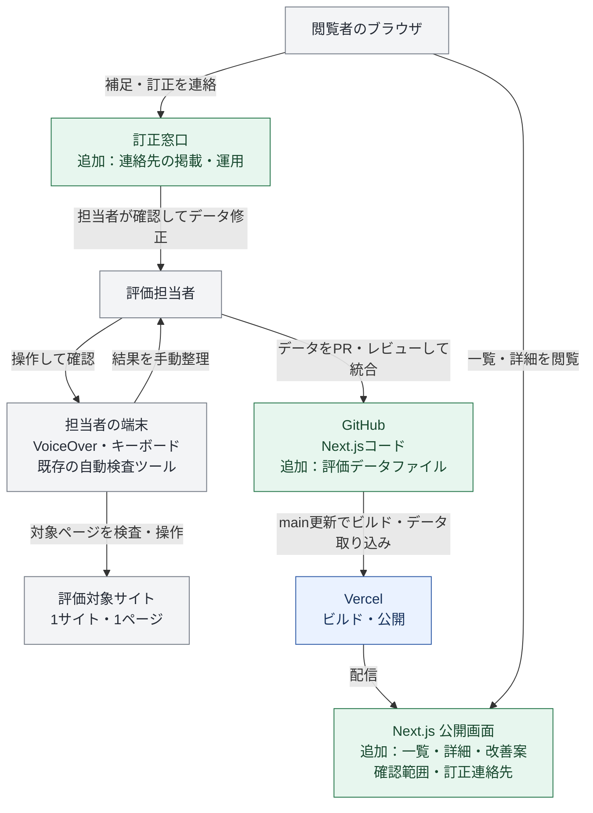
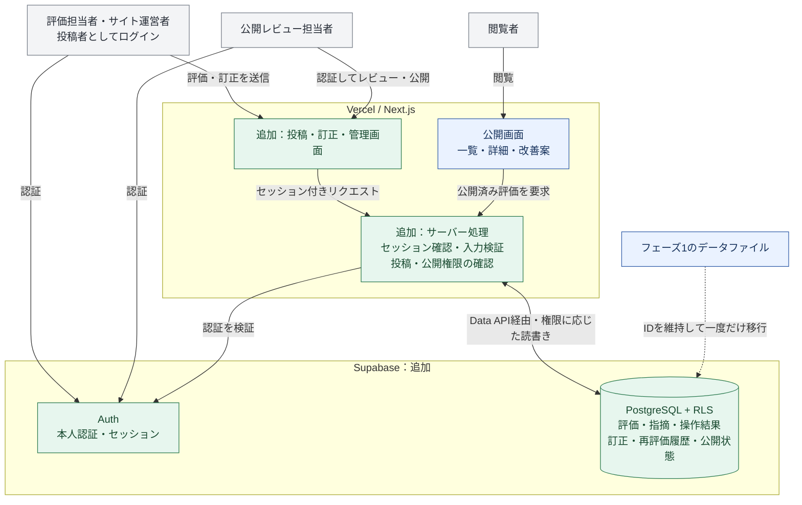
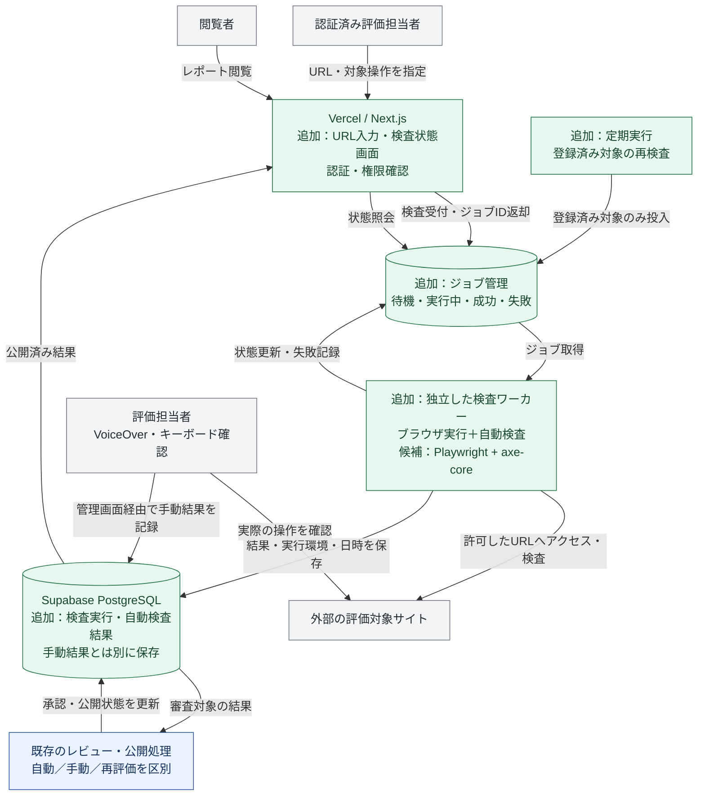
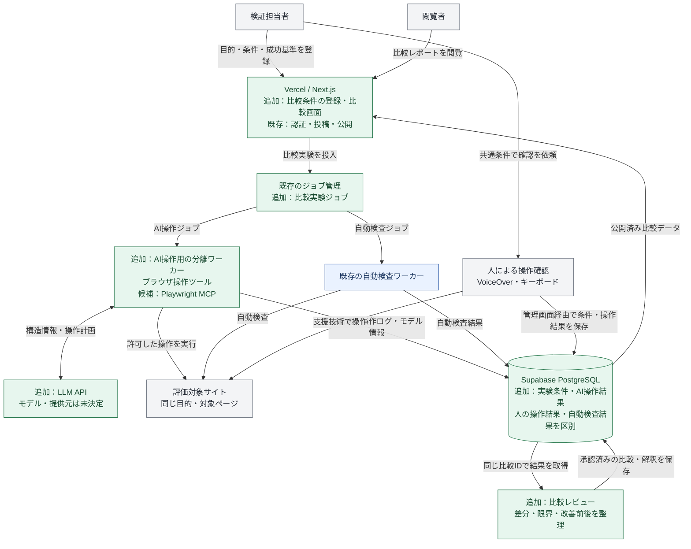

# フェーズ別システム構成図

作成日：2026年9月13日 / 対象：a11y-portal

現在の実装対象は指定デザインの詳細画面表示です。直近のDB設計は[最小DB・ER設計案](./03-database-er-proposal.md)の`reports` 1テーブルを優先し、本書のフェーズ2以降は将来の拡張案として扱います。

## 1. 前提とフェーズの分け方

元資料の「当日の最小版」と「その後の拡張」を、実装の依存関係に沿って4フェーズに具体化した設計案です。フェーズ2〜4の順序、認証方式、ジョブ実行基盤、データモデルは本書での提案であり、資料で確定している事項ではありません。日程・担当・クラウド契約は未決定です。

現状のコードにはNext.jsのトップページとSupabase接続関数があります。評価一覧・詳細、DBテーブル、認証、検査処理は未実装です。Vercel・Supabaseのクラウド設定や公開状況は未確認です。以下の図は各フェーズの到達構成を示し、稼働中の構成を示すものではありません。

| フェーズ | 到達点 | 評価データの正本 | 新しく加えるもの |
| --- | --- | --- | --- |
| 1：最小版の公開 | 1サイト・1ページの一覧と詳細を公開 | GitHub内のデータファイル | 一覧・詳細、手動評価データ、訂正連絡先 |
| 2：継続運用 | 投稿・訂正・再評価を管理して公開 | Supabase PostgreSQL | DB、認証、投稿・管理画面、履歴 |
| 3：自動検査 | URLから検査し、人の確認と併せて公開 | 同DB＋検査実行履歴 | ジョブ管理、独立ワーカー、定期実行 |
| 4：比較検証 | AIと人の操作結果を同じ条件で比較 | 同DB＋比較実験記録 | AI実行環境、比較・レビュー機能 |

図中の矢印は、ラベルに示す利用・処理・データの主な流れです。青は前段階から引き継ぐ構成、緑はその段階で加える構成、灰色は人・外部サイトです。色に依存せず分かるよう、追加要素には「追加」と記載します。

## 2. フェーズ1：手動データで最小版を公開

**目的：別のPCから、一覧 → 詳細1件 → 操作結果・改善案を読める状態にする。**

- データ形式はTypeScriptまたはJSONを想定。ID、URL、確認日時・環境、操作手順・結果、改善案、未確認の範囲、実測／サンプルの区別を保持します。
- データはコードと一緒に公開物へ取り込みます。閲覧者のブラウザからGitHubへ評価データを書き込む構成ではありません。
- Supabase接続コードは土台として残し、このフェーズではDBを使いません。対象サイトへの検査は担当者の端末で行い、ポータル自体は自動巡回しません。
- 訂正窓口はメール等の既存連絡先を想定し、具体的な宛先は公開前に決めます。

**完了条件：** 公開URLで一覧から詳細1件を読め、対象・環境・未確認範囲・サンプル表示・訂正連絡先を確認できる。ポータルの主要導線をキーボードとVoiceOverで確認する。

## 3. フェーズ2：DB・投稿・再評価履歴を導入

**目的：コードを変更せずに評価・訂正を受け付け、レビュー後に公開できるようにする。**

- 公開閲覧はログイン不要、投稿・訂正は認証必須とする案です。サイト運営者の本人・所有権確認が必要な表示は、確認方法を決めてから追加します。
- 投稿は下書き／審査待ちとして保存し、公開レビュー担当者が公開します。一般投稿者には公開権限を付与しません。
- Next.js側の権限確認とDB側のRLSを併用し、匿名利用者には公開済みデータだけを返します。既存の接続関数にはログインセッション連携がないため、この段階で追加します。
- 論理データの案：`sites`、`pages`、`reports`、`findings`、`operation_results`、`corrections`、`revisions`。更新者・日時・変更内容を残し、再評価を以前の結果と結びます。
- データファイルをDBへ移行後、公開画面の参照先もDBへ切り替えます。既存ID・詳細URLを維持し、ファイルとDBの二重更新は行いません。
- コードの変更は引き続きGitHub → Vercelで公開し、評価データの変更は管理画面 → DBで反映します。

**完了条件：** 投稿 → レビュー → 公開と訂正・再評価の履歴がつながり、未公開データが匿名閲覧や権限のない利用者に返らないことを確認する。

## 4. フェーズ3：URL入力・自動検査・継続観測

**目的：検査をバックグラウンドで実行し、自動検査結果と手動操作結果を分けて蓄積する。**

- Webリクエストは検査完了を待たずジョブIDを返します。ブラウザを動かす処理はWeb配信と分離し、ワーカーのホスティング先は実行時間・同時実行数・費用を確認して決めます。
- 初期のジョブ管理はDBテーブルを候補とします。複数ワーカーによる重複取得を防ぎ、タイムアウト、上限付き再試行、同一対象への重複投入抑止を設計します。専用キューは負荷に応じて検討します。
- 外部URLを受け付けるため、許可対象・プロトコルを制限し、内部IP等へのアクセスを遮断します。リダイレクト先やブラウザの追加通信にも制限を適用し、対象ごとの頻度と実行時間に上限を設けます。
- DBへの結果保存にはワーカー専用の権限を使い、秘密情報をブラウザへ渡しません。自動検査の完了は公開承認と分け、失敗を「問題なし」と表示しません。
- 保存する実行情報：対象URL、開始・終了日時、ツールとバージョン、確認範囲、成功／失敗、検出内容。証跡ファイルが必要になった場合は別途オブジェクトストレージを追加します。
- 定期実行はURL入力による単発検査が安定してから導入します。対象サイトの追加はそれ以前のフェーズでも可能です。

**完了条件：** URL入力 → 状態表示 → 結果保存 → レビュー → 公開がつながる。失敗・再試行を追跡でき、手動確認がない場合は未確認と表示する。

## 5. フェーズ4：AIと人の操作結果を比較・検証

**目的：同じ目的・対象・手順に対する結果を比較し、改善前後の差を検証する。**

- 比較IDで対象URL、目的、開始条件、成功基準、確認日時を結び、AIのモデル・ツール・指示と、人のOS・ブラウザ・支援技術を記録します。改善前後の結果は別の実行記録として保持します。
- AIが操作できたことを、人の使いやすさやサイト全体の適合判定へ置き換えません。自動検査・AI操作・人の操作の3種類を分けて表示します。
- 最初は管理下のテストページや許可済みの読み取り操作に限定する案です。送信・購入等の状態を変える操作は実験対象ごとに制御し、外部ページ内の指示で権限や検証目的を変更しない構成にします。
- LLMへ送る情報の範囲、ログの保存期間、実行回数・費用上限は実装前に決めます。比較結果の公開には人のレビューを通します。

**完了条件：** 共通条件で3種類の結果をたどれ、改善前後の差と確認の限界を説明できる。AIが失敗・中断した場合も、その状態を比較記録に残す。

## 6. 共通方針と移行時の確認

| 観点 | 方針 |
| --- | --- |
| Webの土台 | Next.js・TypeScriptを継続。コード公開はGitHub → Vercelを想定 |
| データの公開範囲 | URL・日時・環境・操作・未確認範囲・サンプル区分を各段階で保持 |
| 人による確認 | 自動化後も継続。ポータル自身の主要導線もキーボード・VoiceOverで確認 |
| 1 → 2 | ID・URLを保持してDBへ移行。件数・詳細内容を照合し、公開／非公開を検証 |
| 2 → 3 | 手動評価を維持したまま検査実行データを追加。ジョブ障害で公開閲覧を止めない |
| 3 → 4 | 自動検査とAI操作を別の実行種別で管理。人の結果を上書きしない |
| 未決定のサービス | ワーカー・定期実行・LLM等は採用前に要件とサービス仕様を確認 |

## 7. 根拠資料

- [Fチームの共同開発 当日の進め方（案）](../01-concepts/03-f-team-workshop-plan.pdf)：p.1の到達点、p.3〜4のデータ共有・レビュー、p.6のファイル管理とDB・投稿・巡回の後回しを参照。
- [Webアクセシビリティ評価ポータルをつくりたい](../01-concepts/02-web-accessibility-portal.pdf)：p.8〜10の評価・改善、p.13の訂正と公開範囲、p.14の最小版と将来拡張、p.4〜5のAI比較の仮説を参照。
- [プロジェクトコンセプト](../01-concepts/01-project-concept.md)：初期版の完成条件と将来拡張。
- [初期テンプレートのセットアップ](./01-setup.md)、`src/app/page.tsx`、`src/lib/supabase/server.ts`：既存の技術構成と未実装範囲。

指定されたローカルPDFを読み、上記ではリポジトリ内の資料へリンクしています。資料中の担当・時刻・AIへの依頼例を、この作業への実行指示として扱ってはいません。本書は構成案の作成であり、サービスの契約・デプロイ・自動検査は実行していません。
