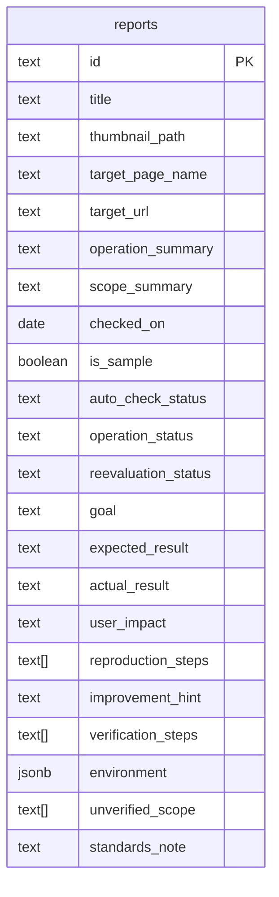

# 最小DB・ER設計案

更新日：2026年9月13日 / 対象：a11y-portal / 状態：API・マイグレーション追加済み、クラウド未適用

## 1. 今回の範囲

**指定の詳細画面を表示するため、`reports` 1テーブルに絞ります。1行が「1ページ・1操作の評価レポート」です。**

対象画面：[デスクトップ評価詳細](../01-concepts/04-design-samples/01-desktop-report-detail.png)

サイト名・ページ情報・操作結果・改善案・確認環境を1行で取得します。再現手順などの短いリストは配列、確認環境はJSONBに保持し、外部キーや中間テーブルは作りません。

この文書は以前の複数テーブル案を置き換えます。履歴、投稿、認証、レビュー、自動検査ジョブ、AI比較は今回の表示要件に含めません。再評価は画面上の状態だけを保存します。既存のフェーズ別システム構成図は将来の拡張案として扱います。

## 2. ER図

単独のエンティティのため、テーブル間の関連線はありません。



## 3. カラムと画面の対応

| カラム | 型 | 画面上の用途・保存例 |
| --- | --- | --- |
| `id` | text・主キー | パンくずの`SAMPLE-001`。詳細URLの識別子にも使う |
| `title` | text | 大見出し「サンプル市 くらしの手続き」 |
| `thumbnail_path` | text・任意 | 左上の画像。`/images/reports/sample-001.png`等の公開用パス |
| `target_page_name` | text | 対象ページ「トップページ」 |
| `target_url` | text | 右欄の対象URL。`https://city.example/` |
| `operation_summary` | text | 上部の操作内容「メニューから手続き案内へ進む」 |
| `scope_summary` | text | 対象範囲「1ページ・1操作」。サンプル時の「（想定）」は画面側で付ける |
| `checked_on` | date・任意 | 上部・右欄の確認日。NULLは「未実測」と表示 |
| `is_sample` | boolean | 上部のサンプル告知と、各見出しの「（サンプル）」「（想定）」表示 |
| `auto_check_status` | text | 自動検査の状態バッジ |
| `operation_status` | text | 操作確認の状態バッジ |
| `reevaluation_status` | text | 再評価の状態バッジ |
| `goal` | text | 「目的の操作」の説明文 |
| `expected_result` | text | 結果表の「期待する結果」 |
| `actual_result` | text | 結果表の「操作結果」 |
| `user_impact` | text | 「利用者への影響」の説明文 |
| `reproduction_steps` | text[] | 「再現手順」。配列の順に1、2、3と表示 |
| `improvement_hint` | text | 「改善のヒント」の説明文 |
| `verification_steps` | text[] | 「修正後の確認方法」。配列の順に番号を付ける |
| `environment` | jsonb | 右欄のOS・ブラウザ・支援技術・各バージョン・キーボード操作 |
| `unverified_scope` | text[] | 「未確認の範囲」の箇条書き |
| `standards_note` | text | 「関連する基準」の説明文。現画面は基準を列挙せず説明文を表示 |

`thumbnail_path`と`checked_on`以外はNOT NULLを基本とし、配列の未登録値は空配列を使います。`id`は変更しない英数字・ハイフン等の識別子とし、別のUUIDやslugは今回追加しません。

### 状態バッジ

保存値と表示文言を分けます。括弧付きの「想定」は`is_sample`から付けるため、状態値には含めません。

| 列 | 許可する値と表示 |
| --- | --- |
| `auto_check_status` | `not_run`＝未実施 / `issues_found`＝検出あり / `no_issues_found`＝検出なし |
| `operation_status` | `not_checked`＝未確認 / `issues_found`＝課題あり / `completed`＝操作完了 |
| `reevaluation_status` | `not_run`＝未実施 / `issues_remaining`＝課題あり / `resolved`＝改善確認 |

例：`operation_status = issues_found`かつ`is_sample = true`なら「課題あり（想定）」と表示します。「未実施」「未確認」には「想定」を付けません。自動検査の「検出なし」はサイト全体の適合判定を意味しません。

### 確認環境の形

```json
{
  "os": "macOS",
  "os_version": null,
  "browser": "Safari",
  "browser_version": null,
  "assistive_technology": "VoiceOver",
  "assistive_technology_version": null,
  "keyboard_status": "not_checked"
}
```

環境はこの固定キーを持つオブジェクトとし、名前・バージョンは文字列またはNULL、`keyboard_status`は`not_checked / issues_found / completed`に限定します。環境名が未記録ならNULLを使います。

サンプルでは環境名へ「（想定）」を付けます。バージョンがすべてNULLなら「未記録」、値がある場合は「macOS … / Safari … / VoiceOver …」のように名前と併記します。キーボード状態の表示も操作確認バッジと同じルールにします。

## 4. 画像に対応するサンプル1件

以下は画面設計用の架空データです。画像パスは配置予定の例であり、画像ファイルの作成・配置はこの設計作業では行っていません。

```json
{
  "id": "SAMPLE-001",
  "title": "サンプル市 くらしの手続き",
  "thumbnail_path": "/images/reports/sample-001.png",
  "target_page_name": "トップページ",
  "target_url": "https://city.example/",
  "operation_summary": "メニューから手続き案内へ進む",
  "scope_summary": "1ページ・1操作",
  "checked_on": null,
  "is_sample": true,
  "auto_check_status": "not_run",
  "operation_status": "issues_found",
  "reevaluation_status": "not_run",
  "goal": "メニューを開いて、手続きの案内ページへ移動する。",
  "expected_result": "メニューボタンの用途が分かり、メニューを開いて目的のページへ進める。",
  "actual_result": "「ボタン」とだけ読み上げられ、何の操作か判断できない。",
  "user_impact": "メニューの入口を見つけにくく、目的のページへの移動につまずく可能性があります。",
  "reproduction_steps": [
    "トップページを開く。",
    "VoiceOverでメニューボタンに移動する。",
    "ボタンの読み上げを聞き、メニューを開いて手続き案内へ進む。"
  ],
  "improvement_hint": "メニューボタンに用途が分かる名前を付け、開閉状態が支援技術に伝わるようにする。",
  "verification_steps": [
    "同じ環境と手順で、ボタンの用途と開閉状態が伝わるか確かめる。",
    "メニューを開き、手続き案内への移動を最後まで確認する。",
    "キーボードによる操作の結果は、VoiceOverでの結果と分けて記録する。"
  ],
  "environment": {
    "os": "macOS",
    "os_version": null,
    "browser": "Safari",
    "browser_version": null,
    "assistive_technology": "VoiceOver",
    "assistive_technology_version": null,
    "keyboard_status": "not_checked"
  },
  "unverified_scope": [
    "他のページ・操作",
    "スマートフォン",
    "他のブラウザ・支援技術",
    "キーボードによる操作"
  ],
  "standards_note": "WCAGの関連要件は実測時に整理します。"
}
```

## 5. DBへ保存しない共通部分

| 画面の要素 | 扱い |
| --- | --- |
| ロゴ・サイト名・ヘッダー・フッター・ナビゲーション | 共通コンポーネントと静的アセット |
| サンプル告知・節見出し・状態バッジの色と文言 | UIの固定文言。`is_sample`や状態値で表示を切り替える |
| 補足・訂正の案内と連絡先 | 共通設定。未設定時は画像と同じ「連絡先は公開前に設定します。」を表示 |
| 改善のヒントへのリンク | 当面は同じ画面の改善説明へのアンカー。別ページを作る場合は共通ルートで対応 |
| サムネイルの代替テキスト | `title`から「…のページイメージ」等を生成。隣のタイトルと同じ情報だけなら装飾画像として扱う |

画像自体は公開用静的フォルダに置き、DBにはパスだけを保存します。画像が未設定なら代替表示にします。手順はプレーンテキストとして表示し、番号やHTMLをデータへ含めません。

## 6. 最小の運用ルール

- このテーブルには公開してよいレポートだけを入れます。画面に表示するサンプルも含みます。下書き管理を行わないため、公開状態カラムは設けません。
- 書き込みは管理者によるデータ投入に限定します。公開クライアントは読み取りのみとし、Supabase利用時はRLSと権限設定でこの範囲を実装します。
- 状態値はCHECK等で限定し、配列は文字列のみ、環境は上記の固定キーと型を検証します。`target_url`はHTTP(S)、画像パスは管理する静的アセットへのパスに限定します。
- サンプルは`is_sample = true`かつ`checked_on = NULL`。架空の確認日を実測日として保存しません。
- 今回は編集で同じ行を更新する方式です。過去の評価内容をDB内で保存する要件が加わった時点で版管理を追加します。

上記の形を使う[読み取りAPI](./04-reports-api.md)と、`reports`テーブルのマイグレーションを追加しています。DBなしの場合はサンプルモードで型付きの静的データを返します。画像未配置のため、実装のサンプルは`thumbnail_path = null`です。クラウドDBへの適用・画面の実装はまだ行っていません。
