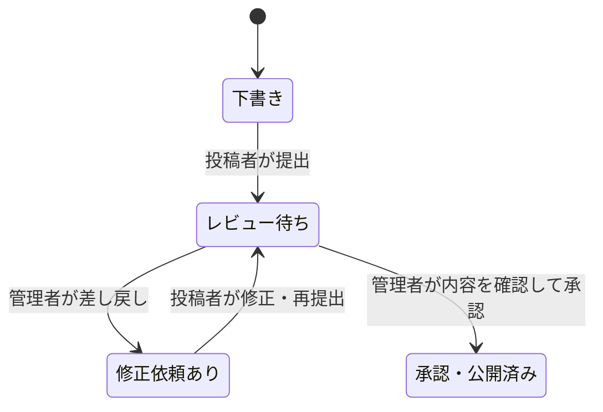

# 投稿・訂正・再評価と公開履歴

登録済みの投稿者が評価を下書きに保存し、管理者のレビューを経て公開できます。訂正・再評価も同じ流れで受け付け、承認前の公開内容と承認後の内容を履歴から確認できます。公開中のレポートは、提案の作成・編集・差し戻し中も閲覧できます。

## 導入

既存のCMSマイグレーションに続けて、`supabase/migrations/20260914000000_submissions_and_history.sql` を適用します。既存の公開レポートはそのまま残り、導入時点の内容が最初の履歴になります。本番DBへの適用とアプリのデプロイは、このローカル実装作業では実行していません。

`REPORTS_DATA_SOURCE=supabase` とSupabaseの接続情報が必要です。サンプルモードでは公開画面の見本を閲覧できますが、ログイン・投稿は利用できません。

投稿者はSupabase Authの登録済みアカウントを使用します。一般投稿者を `report_admins` に登録する必要はありません。公開レビュー担当者だけを同テーブルに登録します。管理者の設定は[CMSの手順](05-report-cms.md)を参照してください。サイト運営者の所有権を確認する仕組みは追加していません。

## 操作

1. `/contribute/login` から投稿者としてログインし、「新しい評価を投稿する」を開きます。
2. サイト名・対象URL・確認日時・環境・操作結果を入力します。評価CLI等で作成したJSONを読み込むこともできます。確認前のタスクを残した下書きも保存できます。
3. 公開履歴に残す変更の説明を入力します。内容を確認して「提出する」を押すと、レビュー待ちになります。未確認のタスクや「（記入）」が残っている内容は提出できません。
4. 管理者が `/admin/submissions` で確認します。修正が必要ならコメントを付けて差し戻します。投稿者は自分の投稿から修正し、再提出できます。
5. 管理者が公開内容を確認し、「承認して公開する」を押すと公開されます。一般投稿者にはこの権限がありません。

訂正・再評価は公開レポートの「補足・訂正を提案する」「再評価を投稿する」から始めます。レポートIDは維持します。再評価では確認日時と操作結果をあらためて記入し、自動検査結果は前回分を新しい検査として引き継ぎません。



## 競合と公開履歴

画面を開いた時点の本文と版番号を一緒に取得します。保存までに対象が更新されていた場合や、レビュー中に別の訂正が承認された場合は、古い提案で上書きせず競合として止めます。入力内容を控え、最新版から提案を作り直してください。投稿自体の同時編集も版番号で検出します。

公開内容の差し替え、公開履歴の保存、投稿の承認状態の更新は、DBの一つのトランザクションで行います。履歴には公開時の全文・変更の種類・説明・日時を保存し、更新者と元の投稿も内部記録に残します。一般公開する履歴にはアカウントIDや非公開のレビューコメントを含めません。

`/reports/<id>/history` から履歴一覧を開き、各版の内容を確認できます。履歴の版番号はレポートの更新番号なので、連続した数になるとは限りません。現行レポートを公開停止すると、その履歴も公開画面と匿名のDBアクセスから読めなくなります。

## APIとDBの境界

| 経路 | 用途・権限 |
| --- | --- |
| `POST /api/contributor/session` | 投稿者ログイン。HttpOnly・SameSite Cookieを使用 |
| `GET/POST /api/submissions` | 自分の投稿一覧・作成 |
| `GET/PATCH /api/submissions/<id>` | 自分の下書きの取得・保存・提出 |
| `PATCH /api/admin/submissions/<id>` | 管理者だけが差し戻し・承認 |
| `GET /api/reports/<id>/history` | 現在公開中のレポートの履歴一覧。`version`で全文を指定 |

作成時の本文は `{ kind, document, changeSummary, sourceRevision }` です。`kind`は`new`・`correction`・`reevaluation`。`sourceRevision`は訂正と再評価で必須です。編集・提出・レビューは対象投稿の`revision`を送ります。

投稿テーブルは本人と管理者だけが読めます。直接のINSERT・UPDATEは許可せず、RPCでも本人・管理者・状態・版番号を確認します。Cookieを使う変更APIでは同一OriginとJSON形式を検証します。公開する本文は既存CMSと同じ検証を通します。

## 検証

本番ビルド後に実行します。

```sh
npm run test:submissions
npm run test:submissions:ui
```

前者はテスト用PostgreSQLの実際のマイグレーション・権限・トリガーとHTTP APIを使います。本人以外の下書き取得、一般投稿者の公開、同時承認、作成前と承認前の版競合、訂正・再評価履歴の保存、非公開化後の遮断を確認します。

後者はインストール済みのChromeで、ログイン、未確認状態の下書き、保存失敗時の入力保持、提出、差し戻し、再提出、承認、訂正、履歴の閲覧を操作します。画面画像は `_work/submissions-ui/` に保存されます。実Supabaseへの書き込みやGitHubへの投稿は行いません。自動アクセシビリティ検査はVoiceOverの実機確認を代替しません。

独立したセキュリティレビューで見つかった「画面を開いてから初回保存までの版競合」は修正し、限定再レビューで解消を確認しました。一般投稿・公開履歴の導入であり、[構成案](02-system-architecture.md)の自動検査ジョブ・定期巡回・AI比較は引き続き別の実装項目です。
