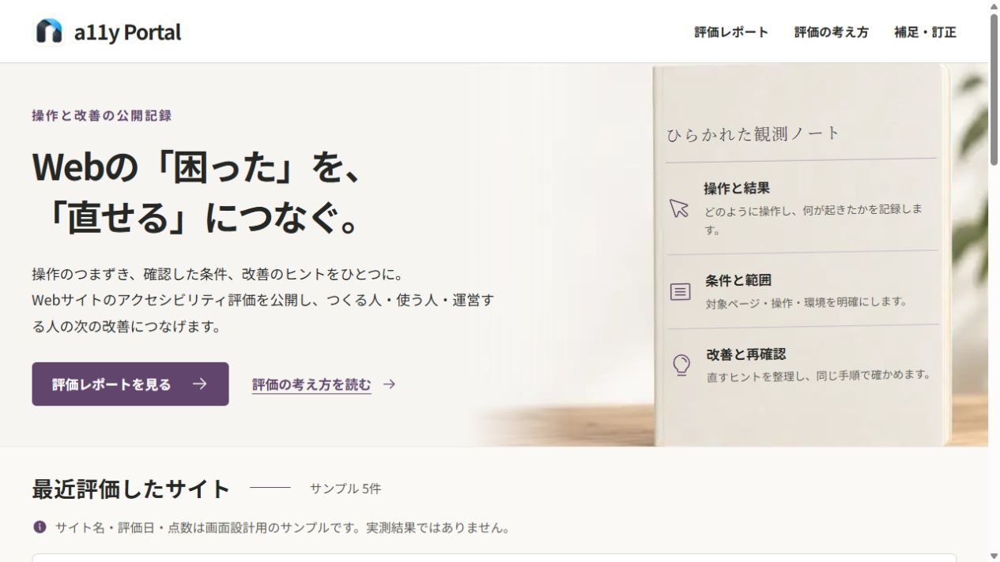
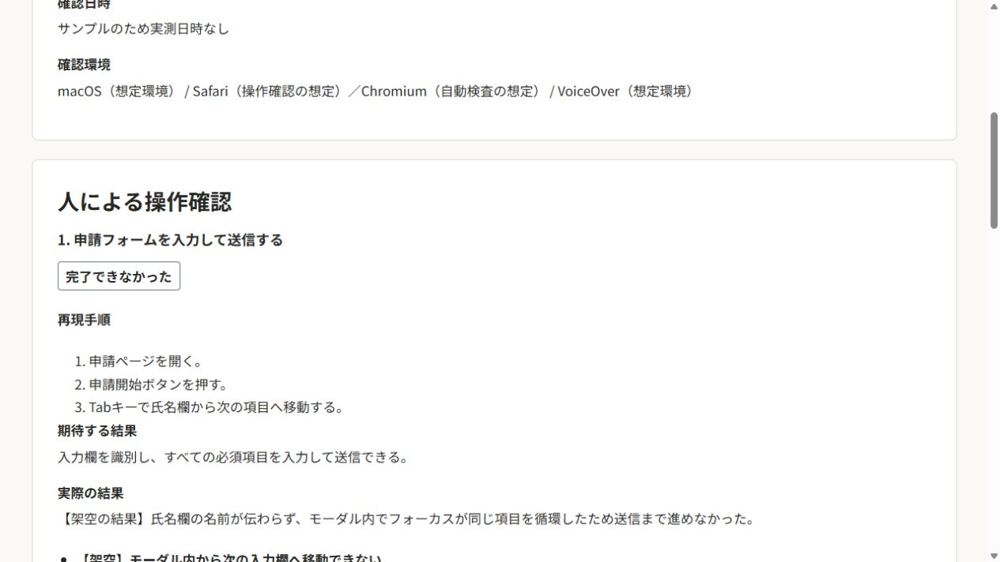

<!-- _class: cover -->

2026.09.13　バイブコーディングオフ会｜成果報告

# 困りごとと改善案を共有する ポータルを、3人で実装・公開

a11y Portal

Webサイトの操作で困る箇所と、 直すヒントを日本語で共有する アクセシビリティ評価ポータル。

公開レポート評価の下書き管理CMS

せいさん · さくらいさん · NAGI

a11y-portal.vercel.app　／　公開中のトップ画面

<a href="https://a11y-portal.vercel.app/">公開サイトを見る ↗</a>　｜　画面内の掲載例は架空サンプル

<!--
約40秒。Webサイトが使いにくかったとき、問題と改善方法を同じ場所で共有するためのポータルです。3人で公開画面、評価下書き生成、管理CMSを実装しました。2026-09-13のmain b9be5d2と、16:10 JST前後の公開サイトを基準にしています。実運用の検証がすべて終わったという報告ではありません。
根拠: docs/01-concepts/01-project-concept.md、Deploy https://github.com/Nagi-Inaba/a11y-portal/actions/runs/34744317663、公開画面。
-->

---

01　どんなものを作ったか

# 操作の手順・結果・改善案を、1つのレポートに

01　何をしたか
対象・環境・操作手順

同じ条件で問題を再現する。

02　何が起きたか
期待した結果と実際の結果

利用者がどこで困るかを伝える。

03　どう直すか
改善のヒント・再確認の手順

修正して、同じ操作で確かめる。

公開レポートの詳細　／　架空サンプル

自動検査と人による操作確認を分けて表示。 この画面は表示確認用の架空データで、実測結果ではありません。

<!--
約45秒。トップや公開一覧から詳細を開けます。詳細では、何をしたか、何が起きたか、どう直すかをつなげて読めます。実際の画面には自動検査の結果、未確認の範囲、連絡先も表示します。いま見せている申請フォームの評価は架空で、実在サイトへの指摘ではありません。
根拠: https://a11y-portal.vercel.app/reports/SAMPLE-EVAL-001、src/components/report-document.tsx、PR #10・#14。
-->

---

02　評価から公開までの仕組み

# 自動検査の下書きを、人が確認して公開する

01　評価コマンド
<h2>URLを検査</h2>
axe-coreで自動検査。 結果をJSONの 下書きにする。

→

02　人による確認
<h2>操作して記録</h2>
操作の目的・手順・ 結果・改善案を 確かめて補う。

→

03　管理CMS
<h2>内容を確認</h2>
JSONを取り込み、 編集・プレビュー。 管理者が公開する。

→

04　公開サイト
<h2>読んで共有</h2>
公開済みだけを 一覧・詳細に表示。 公開停止にも対応。

未確認の操作や記入途中の項目が残っていると、公開できない仕組み。

<h3>今回、実装したこと</h3>
評価コマンド、下書きの取り込み・編集、 管理者向けの保存・公開・公開停止。

<h3>人が確かめること</h3>
操作結果の事実と、確認した範囲。 入力検証だけでは記録の真偽は判断できません。

<!--
約50秒。評価はWeb画面から実行する機能ではなく、CLIコマンドです。出力をCMSへ取り込み、人が操作確認を補います。公開条件はAPIとDBに実装されていますが、これは未記入などを防ぐもので、文章の真実性やアクセシビリティ適合を保証するものではありません。
根拠: scripts/evaluate.mts、docs/02-development/05-report-cms.md、src/lib/cms/document.ts、PR #6・#14。
-->

---

03　3人の主な担当

# 3人の担当をつなぎ、公開まで進めた

せいさん

@seiichi3141
<h2>評価の仕組みと 開発・配信の基盤</h2><ul><li>プロジェクトの初期構築</li><li>URL評価・データ形式</li><li>CI・DB適用・自動配信</li><li>VoiceOver検証の記録</li></ul>
<a href="https://github.com/Nagi-Inaba/a11y-portal/pull/6">PR #6</a> · <a href="https://github.com/Nagi-Inaba/a11y-portal/pull/4">#4</a> · <a href="https://github.com/Nagi-Inaba/a11y-portal/pull/13">#13</a>

さくらいさん

@TomoeSakurai
<h2>公開レポートの 画面とデータ取得</h2><ul><li>トップ・レポート詳細</li><li>公開一覧・詳細API</li><li>最小DB構成</li><li>画面表示・APIの検証</li></ul>
<a href="https://github.com/Nagi-Inaba/a11y-portal/pull/7">PR #7</a> · <a href="https://github.com/Nagi-Inaba/a11y-portal/pull/10">#10</a>

NAGI

@Nagi-Inaba
<h2>デザインと レポート管理CMS</h2><ul><li>画面案・設計ガイド</li><li>アイコンの選定</li><li>下書き・編集・公開</li><li>CMS統合・リリース</li></ul>
<a href="https://github.com/Nagi-Inaba/a11y-portal/pull/8">PR #8</a> · <a href="https://github.com/Nagi-Inaba/a11y-portal/pull/14">#14</a> · <a href="https://github.com/Nagi-Inaba/a11y-portal/pull/15">#15</a>

GitHubのコントリビュータ、PR著者、変更内容を照合した「主な担当」です。

<!--
約45秒。コントリビュータのコミット数を貢献率にはしていません。せいさんは評価コマンドと配信基盤、さくらいさんは公開側の画面とAPI、NAGIはデザインとCMSが中心です。これは履歴から裏付けられる主な担当であり、共同作業や相互レビューを排除する役割分担ではありません。
根拠: GitHub contributors、PR author、非マージコミット d016fb9・197a699・2f41a96・9111f9a・d99f261、a169314・e54e623、7a28752・71f7eeb・99d5d7e・8a1d52b。
-->

---

04　どこまで完成したか

# 公開画面と配信基盤は、動作確認まで進んだ

<table>
<thead><tr><th>対象</th><th>到達した状態</th><th>確認できたこと</th></tr></thead>
<tbody>
<tr><td>公開ポータル</td><td class="state">本番で表示確認</td><td>トップからレポート詳細を閲覧できる</td></tr>
<tr><td>評価コマンド</td><td class="state">実装・生成物あり</td><td>トップページの自動検査JSONを保存</td></tr>
<tr><td>管理CMS</td><td class="state">実装・隔離環境で検証</td><td>ログイン → 編集 → 公開 → 公開停止</td></tr>
<tr><td>DB・配信</td><td class="state">本番デプロイ成功</td><td>DBマイグレーション適用後にVercelへ配信</td></tr>
</tbody>
</table>

<strong>品質確認</strong> CIでLint・型検査・ビルド、 単体・DB・公開API・CMSのテストが成功。

<strong>確認範囲</strong> CMSの操作検証は隔離環境。 実アカウントでのログイン・公開確認は残ります。

<!--
約50秒。公開サイトはこの資料の作成中にトップから詳細まで確認しました。評価コマンドには2026-09-13 05:40 UTCの生成物があります。現在の公開サイト全体を今回再検査したという意味ではありません。CMSの操作はPR #15に記載された隔離環境の検証です。CI #15とDeployの実際のsuccessを確認しています。自動検査で違反が検出されないことをサイト全体の適合判定にはしていません。
根拠: https://github.com/Nagi-Inaba/a11y-portal/actions/runs/34744265029、https://github.com/Nagi-Inaba/a11y-portal/actions/runs/34744317663、PR #15、src/data/reports/a11y-portal-vercel-app-2026-09-13.json。
-->

---

05　実運用に向けて残ること

# 実運用には、ログイン・操作確認・評価設計が残る

01　管理者の実環境
<h2>本番CMSで 一連の操作を確認</h2>
管理者の登録状態を確かめ、 ログインから公開までを 本番環境で検証する。

配信の成功と、実アカウントでの操作成功は別に確認。

02　人による操作
<h2>実際の操作を レポートに記録</h2>
キーボードや読み上げで、 目的の操作を完了できるか 確かめる。

VoiceOver補助検証は進展。対象環境で決定操作は成功せず。

03　評価の運用
<h2>採点方法と 連絡先を整える</h2>
点数の扱いを決め、 補足・訂正の連絡先を 設定する。

画面の架空サンプルは実測実績に数えない。

今回できたのは、<strong>評価の記録をつくり、確認して、公開するための土台。</strong>

<!--
約40秒。残っている作業を3つの観点に整理しています。これは担当者や期限を新しく決めるスライドではありません。VoiceOverについては、Simulator上の項目移動と読み上げテキスト取得の検証記録がありますが、検証した起動経路で決定操作が成功していないという限定した結論です。将来の複数ページ巡回やAI操作比較は拡張案で、今回の完成機能には含めません。
根拠: PR #15、docs/02-development/05-ios-simulator-voiceover-cli.md、公開ホームの採点方法・連絡先の注記。
-->

---

APPENDIX　出典・確認時点

# 根拠は、公開画面と変更履歴で確認できる

<strong>公開サイト</strong>
<a href="https://a11y-portal.vercel.app/">a11y Portal トップ</a> ／ <a href="https://a11y-portal.vercel.app/reports/SAMPLE-EVAL-001">架空サンプルの詳細</a> 画面キャプチャ：2026年9月13日 16:10–16:11 JST

<strong>担当・機能</strong>
<a href="https://github.com/Nagi-Inaba/a11y-portal/graphs/contributors">コントリビュータ</a> ／ <a href="https://github.com/Nagi-Inaba/a11y-portal/pull/6">評価 #6</a> ／ <a href="https://github.com/Nagi-Inaba/a11y-portal/pull/7">API #7</a> ／ <a href="https://github.com/Nagi-Inaba/a11y-portal/pull/10">画面 #10</a> <a href="https://github.com/Nagi-Inaba/a11y-portal/pull/8">デザイン #8</a> ／ <a href="https://github.com/Nagi-Inaba/a11y-portal/pull/14">CMS #14</a> ／ <a href="https://github.com/Nagi-Inaba/a11y-portal/pull/15">リリース #15</a>

<strong>検証・配信</strong>
<a href="https://github.com/Nagi-Inaba/a11y-portal/actions/runs/34744265029">リリースPRのCI成功</a> ／ <a href="https://github.com/Nagi-Inaba/a11y-portal/actions/runs/34744317663">DB適用・本番Deploy成功</a> CMSブラウザ検証の範囲はリリースPRの記録を参照。

<strong>残る確認</strong>
<a href="https://github.com/Nagi-Inaba/a11y-portal/blob/b9be5d2/docs/02-development/05-report-cms.md">CMS導入・検証範囲</a> ／ <a href="https://github.com/Nagi-Inaba/a11y-portal/pull/13">VoiceOver検証 #13</a> 採点方法と連絡先は、公開画面の案内を確認。

ソース基準：main <a href="https://github.com/Nagi-Inaba/a11y-portal/tree/b9be5d2edca0dcc7d857f528b45705ba8620c058">b9be5d2</a>。機能の実装、隔離環境の検証、本番表示を区別して記載。 HTMLは<a href="https://marp.app/">Marp</a>で生成。画像を内包し、ネット接続なしでもスライドを表示できます。

<!-- 発表時は必要に応じて参照。通常は前の6枚で約4〜5分。出典リンクを開くときはネット接続が必要です。 -->
